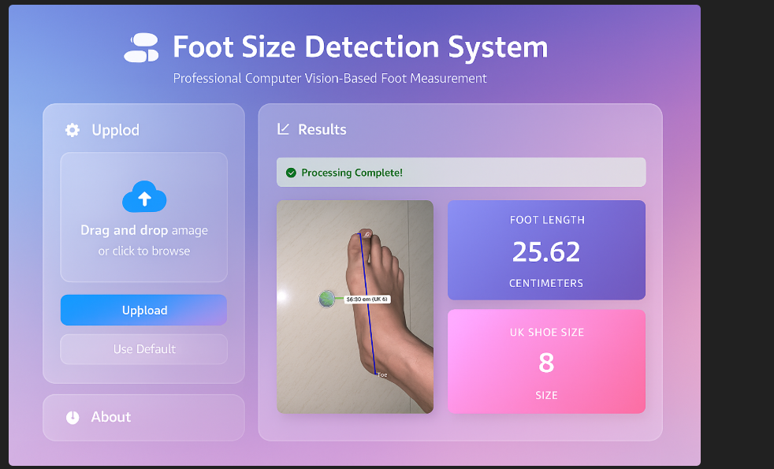

# Foot Size Detector 

A professional, modern web application built with Flask and beautiful HTML/CSS/JavaScript.
## Dashboard

<p align="center">
  
</p>

## 🚀 Quick Start

### 1. Install Dependencies

```bash
pip install -r requirements.txt
```

Or install Flask separately:
```bash
pip install Flask
```

### 2. Run the Application

```bash
python app_flask.py
```

The application will start on `http://localhost:5000`

Open your web browser and navigate to:
```
http://localhost:5000
```

## ✨ Features

### Professional Design
- **Modern UI**: Beautiful gradient background with clean, professional design
- **Responsive Layout**: Works perfectly on desktop, tablet, and mobile devices
- **Smooth Animations**: Fade-in effects and hover animations
- **Bootstrap 5**: Modern CSS framework for professional styling
- **Font Awesome Icons**: Beautiful icons throughout the interface

### User Interface
- **Drag & Drop**: Drag and drop images directly onto the upload area
- **Image Preview**: See your image before processing
- **Real-time Processing**: AJAX-based async processing (no page reload)
- **Loading Indicators**: Visual feedback during processing
- **Results Display**: Beautiful metric cards with gradient backgrounds
- **Download Results**: Download annotated result images
- **Error Handling**: User-friendly error messages

### Technical Features
- **RESTful API**: Clean API endpoints for processing
- **Base64 Encoding**: Images sent as base64 for seamless display
- **File Upload**: Secure file upload handling
- **Error Handling**: Comprehensive error handling
- **Responsive Design**: Mobile-friendly interface

## 🎨 UI Components

### Left Panel
- Image upload area (drag & drop)
- Browse button
- Default image button
- Process button
- Instructions
- About section

### Right Panel
- Image preview
- Loading spinner
- Results display with metrics
- Annotated image
- Technical details
- Download button

## 📋 Usage

1. **Select Image**: 
   - Drag & drop an image onto the upload area, OR
   - Click "Browse Image" to select a file, OR
   - Click "Use Default Image"

2. **Process**: Click "Process Image" button

3. **Click Points**: In the OpenCV window that opens:
   - Click on HEEL first
   - Click on TOE second
   - Press any key to continue

4. **View Results**: Results will be displayed automatically

5. **Download**: Click "Download Result Image" to save the annotated image

## 🔧 API Endpoints

### POST `/api/process`
Process an uploaded image file.

**Request:**
- Content-Type: `multipart/form-data`
- Body: `image` (file)

**Response:**
```json
{
    "success": true,
    "foot_length_cm": 25.5,
    "uk_shoe_size": "8",
    "pixel_distance": 1234.56,
    "scale_factor_mm_per_pixel": 0.0178,
    "annotated_image": "data:image/jpeg;base64,..."
}
```

### POST `/api/default-image`
Process the default image.

**Response:**
Same as `/api/process`

## 🎯 Design Features

### Color Scheme
- **Primary**: Blue (#2196F3)
- **Secondary**: Orange (#FF9800)
- **Success**: Green (#4CAF50)
- **Gradient Background**: Purple gradient

### Animations
- Fade-in animations on page load
- Hover effects on cards and buttons
- Smooth transitions
- Pulse animation on loading

### Responsive Design
- Mobile-first approach
- Adapts to different screen sizes
- Touch-friendly interface

## 📁 Project Structure

```
footsize/
├── app_flask.py          # Flask application
├── foot_size_detector.py # Core processing logic
├── templates/
│   └── index.html        # Main HTML template
├── uploads/              # Temporary upload directory (auto-created)
└── requirements.txt      # Python dependencies
```

## 🔒 Security Notes

- File type validation
- File size limits (16MB max)
- Secure file handling
- Temporary file cleanup

## 💡 Tips

- The application runs in debug mode by default (for development)
- For production, set `debug=False` in `app_flask.py`
- The uploads directory is automatically created
- Images are automatically cleaned up after processing

## 🌐 Deployment

For production deployment:

1. Set `debug=False` in `app_flask.py`
2. Use a production WSGI server (e.g., Gunicorn):
   ```bash
   pip install gunicorn
   gunicorn -w 4 -b 0.0.0.0:5000 app_flask:app
   ```
3. Use a reverse proxy (nginx) for better performance
4. Set up SSL/HTTPS for secure connections

## 🎨 Customization

You can easily customize:
- Colors in the CSS `:root` variables
- Layout in the HTML template
- API endpoints in `app_flask.py`
- Styling in the `<style>` section
